# Remote Guru

An SSH browser for the desktop (Electron): browse remote servers with multiple
tabs, split view and advanced file operations.

## Screenshots

### Connections and settings

| Configuration page | Settings |
| --- | --- |
| 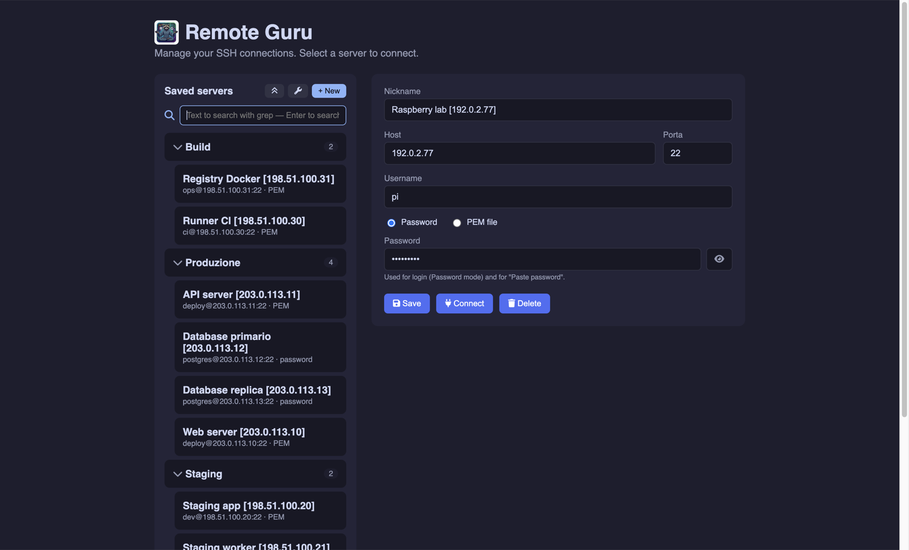 | 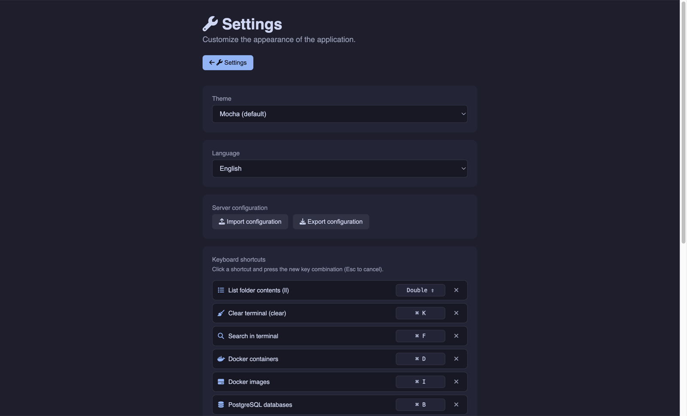 |

Connections are grouped, searchable and stored in `servers.json`; the settings
page covers theme, language, import/export and the keyboard shortcuts.

### Terminal

| Real terminal (PTY) | Buffer search |
| --- | --- |
| 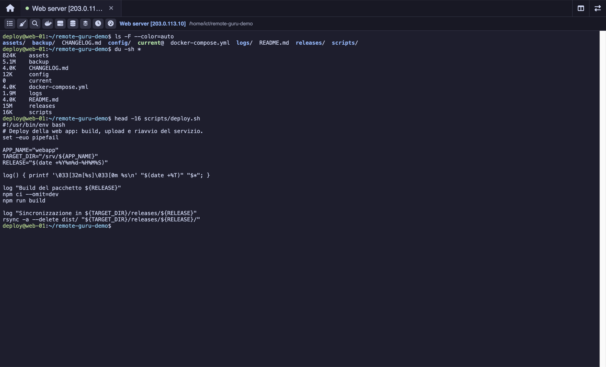 | 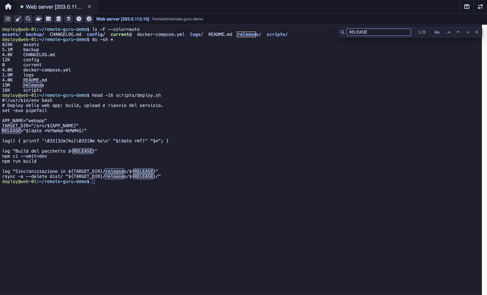 |

Two sessions side by side, with a resizable divider:

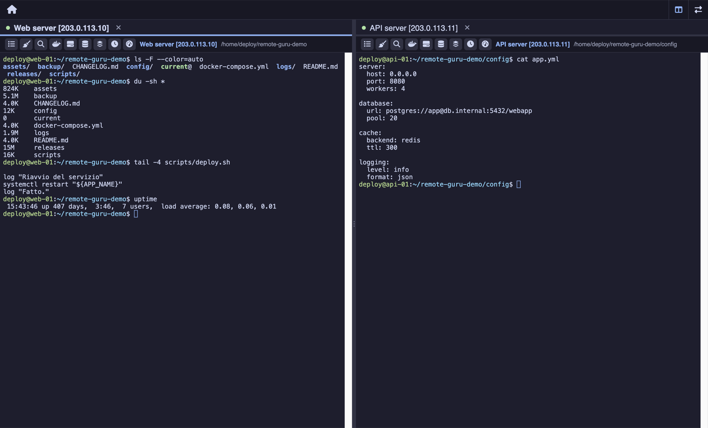

### File browser

| Directory listing | Context menu |
| --- | --- |
| 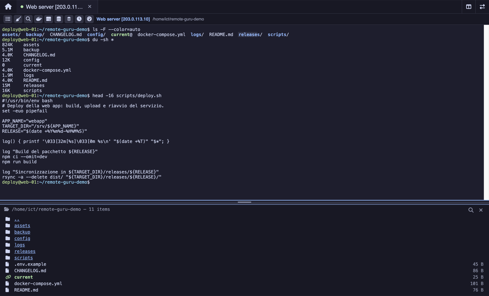 | 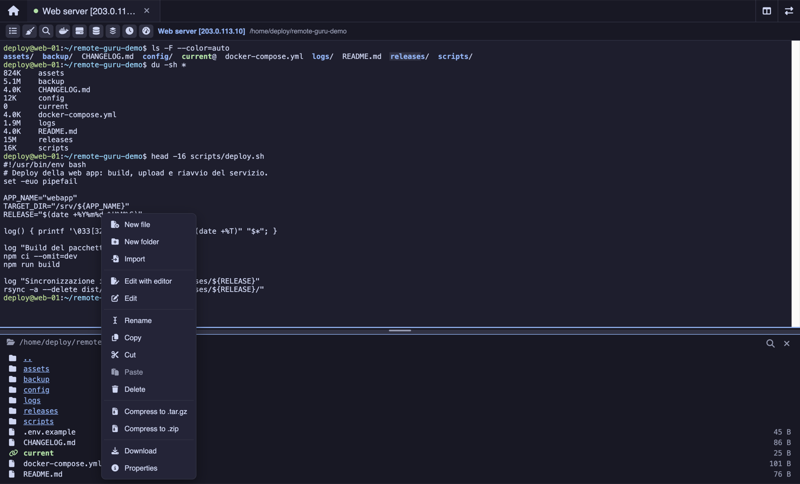 |

| Multiple selection | File properties |
| --- | --- |
| 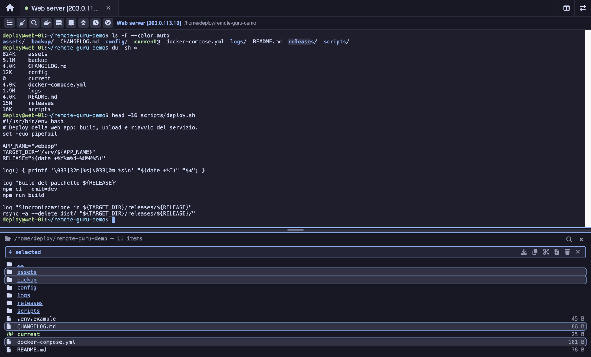 | 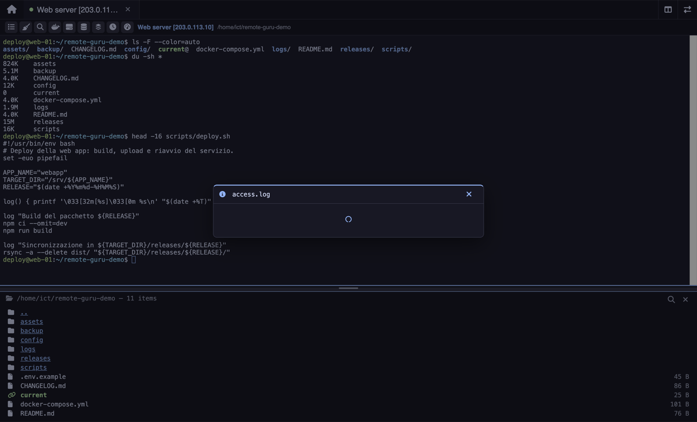 |

| Embedded editor | File transfers |
| --- | --- |
| 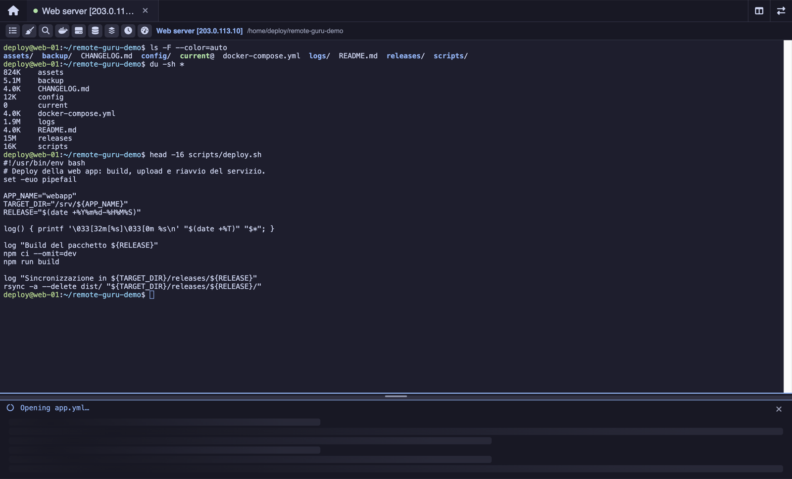 | 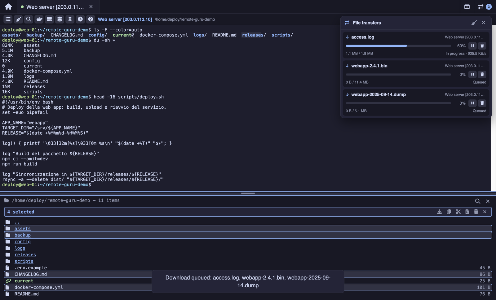 |

### Server panels

| Docker containers | Docker images |
| --- | --- |
| 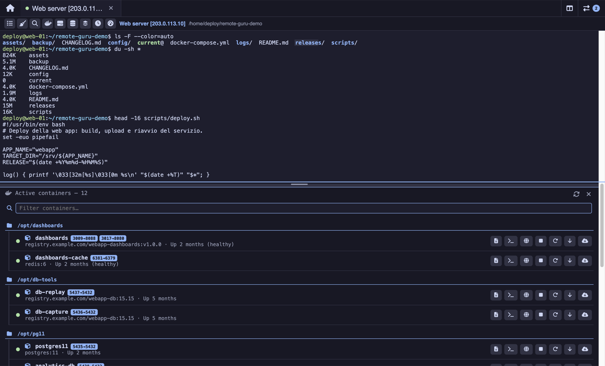 | 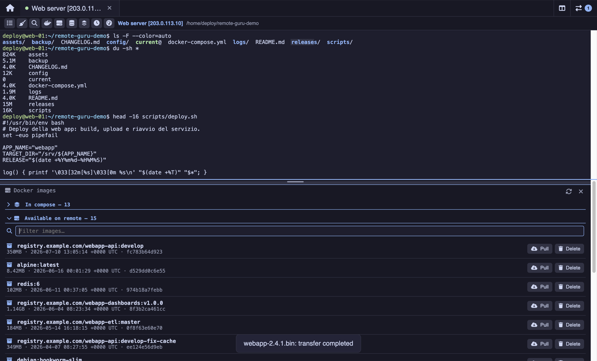 |

| PostgreSQL databases | Screen sessions |
| --- | --- |
| 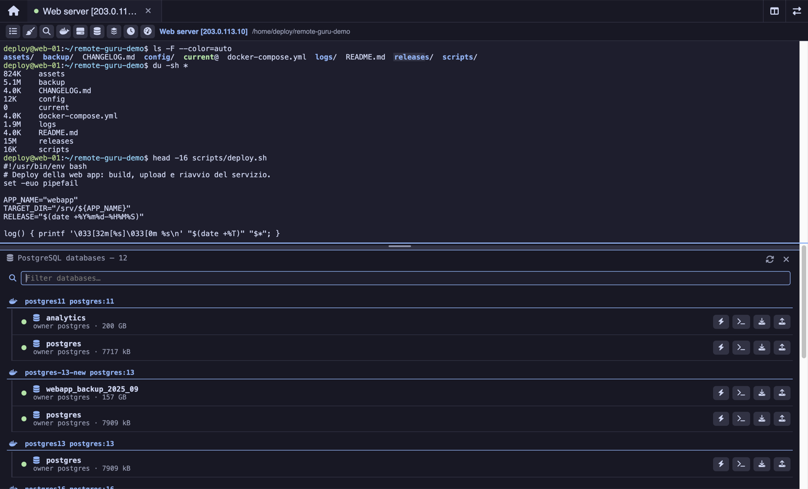 | 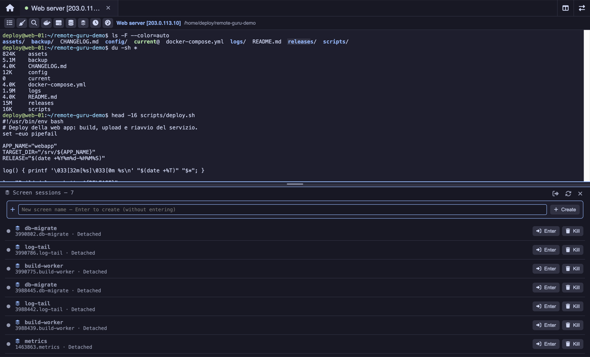 |

System monitor (CPU, memory, network, disks and top processes):

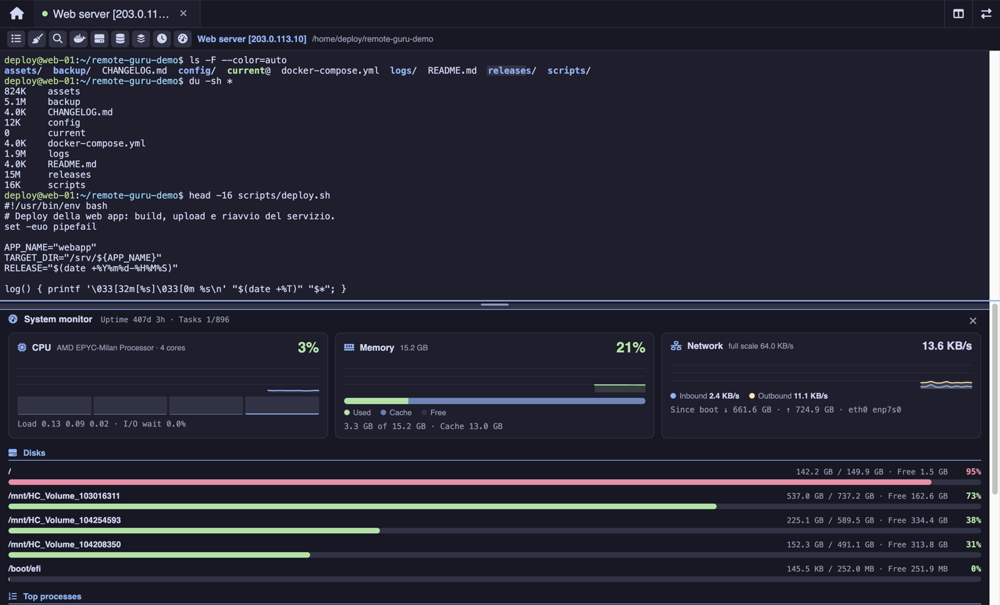

## Getting started

```bash
npm install
npm run start
```

## Build

```bash
npm run dist:mac
```

## Features

- **Configuration page** on startup: add / edit / delete connections, or pick one
  to connect. Connections are stored in `servers.json`.
- **Two authentication modes** per server: password or PEM file (in PEM mode the
  password field is used as the key's optional passphrase).
- **Browser-style tabs**: several connections open at the same time.
- **Split view**: drag a tab into the terminal area to place two sessions
  side by side; the central divider is resizable.
- **Real terminal** (xterm.js + PTY shell) → works with vim, htop, sudo and so on.
- **Terminal buffer search** (`Cmd`/`Ctrl+Shift`+`F`): a bar in the top right with
  a result counter, highlighting of every match, `Enter` / `Shift+Enter` to step
  through them, and toggles for case sensitivity and regular expressions. `Esc`
  closes it.
- **Per-session font zoom** (`Cmd`/`Ctrl+Shift` with `+`, `-` and `0` to return to
  the base size): each tab keeps its own size, and the remote terminal is notified
  of the new geometry.
- **File list button `☰`** next to the server name: shows the contents of the
  current directory (like `ll`). **Directories are clickable** (they `cd`
  automatically).
- **Right-click menu on files and directories** (in the list): new file, new
  directory, rename, copy, cut, paste, delete, compress (`.tar.gz` / `.zip`),
  extract (for archives), download locally, compute size (for directories) and
  **Properties** (type, owner, permissions, dates, link target).
- **Multiple selection** in the list: click to select, `cmd`/`ctrl`+click to add or
  remove an entry, `shift`+click for a range. With an active selection a bar
  appears with bulk actions (download, copy, cut, compress, delete); the same
  actions are available in the context menu, and dragging carries every selected
  entry along.
- **Cut / paste** to move (`mv`): cut entries stay visible, greyed out, until they
  are pasted. Pasting into the same directory gives the copy a `_copy` suffix;
  pasting elsewhere keeps the original name.
- **Upload by dragging from Finder / File Explorer**: dropping files or folders on
  the list panel queues them as uploads into the directory you dropped them on.
- **Drag & drop between file browsers**: dragging a file or directory from one
  tab's list to another's produces an exact copy in the destination directory
  (the one on the row you drop onto, or the one currently shown if you drop on the
  panel background). Between two tabs on the same server the copy happens
  server-side (`cp`); between different machines the data goes through the local
  disk — download into a temporary directory, then upload — and both phases are
  visible in the transfers panel, each one pausable and resumable.
- **Running queries** (the ⚡ button on each database row, which is the only way to
  open it): a `pg_stat_activity` listing filtered to that one database, with a
  status light — green for a query that just started, yellow for a query running
  for more than 5 seconds or an open, idle transaction (`idle in transaction`),
  red for a query waiting on a lock or running for more than a minute. Each row
  shows duration, database, user, wait event, the pid blocking it (clickable: it
  highlights the blocker's row) and the query text, with *Cancel*
  (`pg_cancel_backend`) and *Terminate* (`pg_terminate_backend`). It refreshes
  itself every 4 seconds. Requires PostgreSQL 10 or later.
- **Right-click menu on the terminal**: *Paste password* (inserts the server's
  password taken from `servers.json`).

## `servers.json` format

```json
[
  {
    "nickname": "TEST machine [203.0.113.10]",
    "name": "user@203.0.113.10",
    "host": "203.0.113.10",
    "port": 22,
    "username": "user",
    "usePem": true,
    "pemPath": "/path/to/key.pem",
    "password": ""
  }
]
```

See `servers.example.json` for more examples. **Note:** passwords are stored in
plain text, so `servers.json` is excluded from version control (`.gitignore`).

## Architecture

- `src/main.js` — Electron main process: window, IPC, reading/writing
  `servers.json`, dialogs.
- `src/ssh.js` — SSH session handling (`ssh2`): PTY shell plus an SFTP/exec channel
  for the file features.
- `src/preload.js` — secure bridge (contextIsolation) between renderer and main.
- `src/transfers.js` — file transfer queue (downloads, uploads and server →
  server copies), with progress, pause/resume and state persisted to disk.
- `src/index.html` / `src/styles.css` / `src/renderer.js` — the interface (config,
  tabs, terminal).

The application menu is Electron's default one without the page zoom entries:
their accelerators (`Cmd`/`Ctrl` with `+`, `-`, `0`) are used for the terminal's
font zoom, and a menu accelerator would take precedence over the renderer.

The current working directory is tracked reliably through an invisible marker
(`OSC 1337;CWD=...`) emitted by the shell after every prompt and stripped from the
stream before it is displayed.
